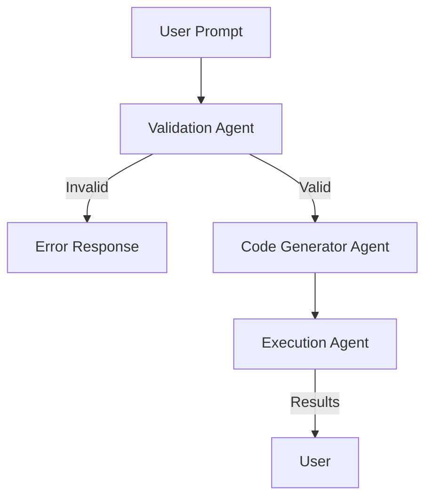

# PromptFetch

AI-Driven Data Query Library for Firebase and Supabase

PromptFetch is an open-source Python library that bridges natural language prompts with database queries, enabling developers to fetch structured data effortlessly from Firebase Firestore and Supabase. Powered by large language models (LLMs), PromptFetch simplifies data retrieval by dynamically generating code to query databases based on user-friendly prompts.

## WorkFlow for the multi-agent

PromptFetch uses AutoGen's multi-agent system to process natural language queries and generate database fetching code. The workflow involves three specialized agents:

1. **Validation Agent (Top Agent)**
   - Receives the natural language prompt
   - Validates the prompt against available database schema
   - Checks if required tables and fields exist
   - Routes valid queries to the Code Generator Agent
   - Provides feedback for invalid queries

2. **Code Generator Agent**
   - Receives validated prompts
   - Uses LLM to generate appropriate database fetching code
   - Supports both Firebase and Supabase syntax
   - Optimizes queries for performance
   - Passes generated code to Execution Agent

3. **Execution Agent**
   - Receives generated code from Code Generator
   - Executes the query against the target database
   - Handles error cases and retries
   - Returns formatted results to the user



## Installation

```bash
pip install promptfetch
```

## Usage

```python
from promptfetch import PromptFetch

# Basic usage example will go here
```

## Development

1. Clone the repository
```bash
git clone https://github.com/yourusername/PromptFetch.git
cd PromptFetch
```

2. Create a virtual environment
```bash
python -m venv venv
source venv/bin/activate  # On Windows: venv\Scripts\activate
```

3. Install development dependencies
```bash
pip install -r requirements.txt
```

4. Run tests
```bash
pytest
```

## Publishing to PyPI

1. Update version in `pyproject.toml`
2. Build the package:
```bash
python -m build
```

3. Upload to PyPI:
```bash
python -m twine upload dist/*
```

## License

This project is licensed under the MIT License - see the LICENSE file for details.
